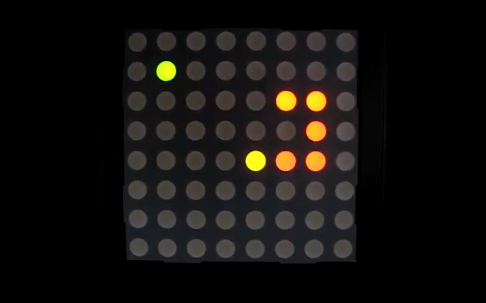
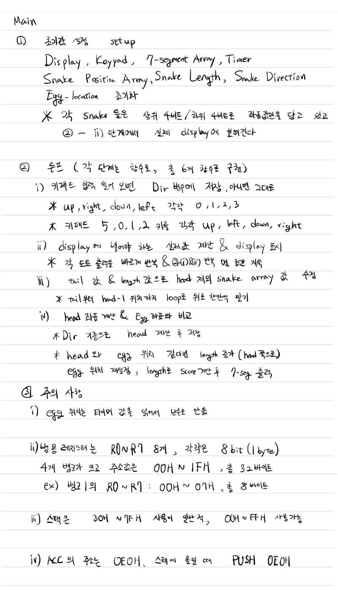
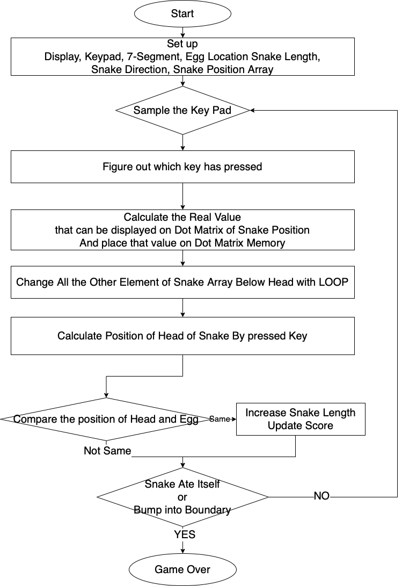
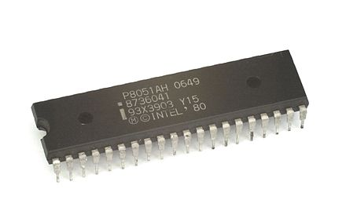
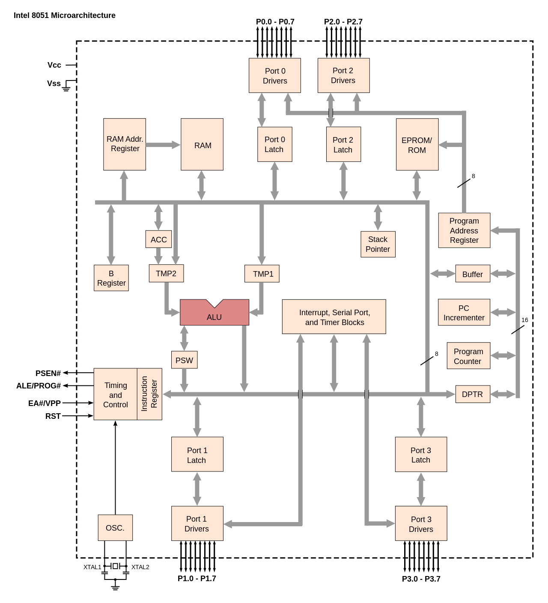

# 8051 Snake Game

Project of  
Making Arcade Console of [snake_game](https://g.co/kgs/fRcm4t) with Intel 8051

# Algorithm

## 한국어

## English

# Hardware

* Intel MCS-51
* 8 * 8 LED dot matrix
* 5 * 5 Keypad
* 7-segment Array

## About Intel MCS-51

A single chip microcontroller (MCU) series developed by Intel for use in embedded systems.

* 8-bit microcontroller
* 4KB ROM
* 128B RAM
* 128B SFR
* external program memory & data memory are extendable for 64KB respectively
* two 16-bit timer/counter 
* 5 interrupt source with hierarchy
* provide power control mode

